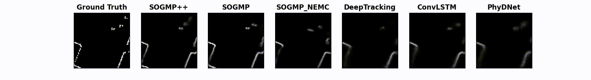
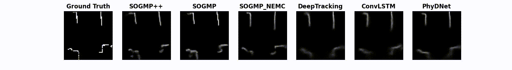

# SOGMP++/SOGMP: Stochastic Occupancy Grid Map Prediction in Dynamic Scenes

Implementation code for our paper ["Stochastic Occupancy Grid Map Prediction in Dynamic Scenes"](https://openreview.net/pdf?id=fSmkKmWM5Ry)([arXiv](https://arxiv.org/abs/2210.08577)) in Conference on Robot Learning (CoRL) 2023. 
Two stochastic occupancy grid map (OGM) predictor algorithms (i.e. SOGMP and SOGMP++) implemented by pytorch. 
Video demos can be found at [multimedia demonstrations](https://youtu.be/lRxuADBL32U).
Here are three GIFs showing the occupancy grid map prediction comparison results (0.5s, or 5 time steps into the future) of our proposed SOGMP++, SOGMP algorithms, and ConvLSTM, PhyDNet, DeepTracking, and SOGMP_NEMC baselines on three different datasets with different robot models.
* OGM-Turtlebot2: 
 
* OGM-Jackal: 
 
* OGM-Spot: 
 

## Requirements
* python 3.7
* torch 1.7.1
* tensorboard

## OGM-Datasets
The related datasets can be found at [OGM-datasets](https://doi.org/10.5281/zenodo.7051560)  
There are three different datasets collected by three different robot models (i.e. Turtlebot2, Jackal, Spot).
* 1.OGM-Turtlebot2: collected by a simulated Turtlebot2 with a maximum speed of 0.8 m/s navigates around a lobby Gazebo environment with 34 moving pedestrians using random start points and goal points
* 2.OGM-Jackal: extracted from two sub-datasets of the socially compliant navigation dataset (SCAND), which was collected by the Jackal robot with a maximum speed of 2.0 m/s at the outdoor environment of the UT Austin
* 3.OGM-Spot: extracted from two sub-datasets of the socially compliant navigation dataset (SCAND), which was collected by the Spot robot with a maximum speed of 1.6 m/s at the Union Building of the UT Austin

## Usage: SOGMP (The inference speed is faster than SOGMP++)
* Download [OGM-datasets](https://doi.org/10.5281/zenodo.7051560) and decompress them to the home directory:
```Bash
cd ~
tar -zvxf OGM-datasets.tar.gz
```
* Training:
```Bash
git clone https://github.com/TempleRAIL/SOGMP.git
cd SOGMP 
git checkout sogmp
sh run_train.sh ~/data/OGM-datasets/OGM-Turtlebot2/train ~/data/OGM-datasets/OGM-Turtlebot2/val
```
* Inference Demo on OGM-Turtlebot2 dataset: 
```Bash
git clone https://github.com/TempleRAIL/SOGMP.git
cd SOGMP 
git checkout sogmp
sh run_eval_demo.sh  ~/data/OGM-datasets/OGM-Turtlebot2/test
```

## Usage: SOGMP++ (The prediction accuracy is higher than SOGMP)
* Download [OGM-datasets](https://doi.org/10.5281/zenodo.7051560) and decompress them to the home directory:
```Bash
cd ~
tar -zvxf OGM-datasets.tar.gz
```
* Training:
```Bash
git clone https://github.com/TempleRAIL/SOGMP.git
cd SOGMP 
git checkout sogmp++
sh run_train.sh ~/data/OGM-datasets/OGM-Turtlebot2/train ~/data/OGM-datasets/OGM-Turtlebot2/val
```
* Inference Demo on OGM-Turtlebot2 dataset: 
```Bash
git clone https://github.com/TempleRAIL/SOGMP.git
cd SOGMP 
git checkout sogmp++
sh run_eval_demo.sh  ~/data/OGM-datasets/OGM-Turtlebot2/test
```

## Citation
```
@inproceedings{xie2023stochastic,
  title={Stochastic Occupancy Grid Map Prediction in Dynamic Scenes},
  author={Xie, Zhanteng and Dames, Philip},
  booktitle={Conference on Robot Learning},
  pages={1686--1705},
  year={2023},
  organization={PMLR}
}

@article{xie2023stochastic,
  title={Stochastic Occupancy Grid Map Prediction in Dynamic Scenes},
  author={Xie, Zhanteng and Dames, Philip},
  journal={arXiv preprint arXiv:2210.08577},
  year={2023}
}

```
