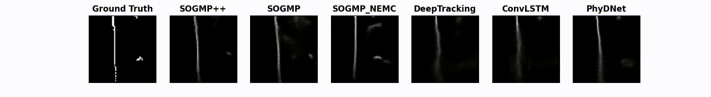

# SOGMP++/SOGMP: Stochastic Occupancy Grid Map Prediction in Dynamic Scenes

Implementation code for our paper "Stochastic Occupancy Grid Map Prediction in Dynamic Scenes". 
Two stochastic occupancy grid map (OGM) predictor algorithms (i.e. SOGMP and SOGMP++) implemented by pytorch. 
Here are three GIFs show the occupancy grid map prediction comparison results (0.5s prediction horizon) of our proposed SOGMP++, SOGMP algorithms, and ConvLSTM, PhyDNet baselines on three different datasets with different robot models.
 
 
 

## Requirements
* python 3.7
* torch 1.7.1
* tensorboard

## OGM-Datasets
The related datasets can be found at: https://doi.org/10.5281/zenodo.7051560. 
There are three different datasets collected by three different robot models (i.e. Turtlebot2, Jackal, Spot).
* 1.OGM-Turtlebot2: collected by a simulated Turtlebot2 with a maximum speed of 0.8 m/s navigates around a lobby Gazebo environment with 34 moving pedestrians using random start points and goal points
* 2.OGM-Jackal: extracted from two sub-datasets of the socially compliant navigation dataset (SCAND), which was collected by the Jackal robot with a maximum speed of 2.0 m/s at the outdoor environment of the UT Austin
* 3.OGM-Spot: extracted from two sub-datasets of the socially compliant navigation dataset (SCAND), which was collected by the Spot robot with a maximum speed of 1.6 m/s at the Union Building of the UT Austin

## Usage:
* Download OGM-datasets from https://doi.org/10.5281/zenodo.7051560 and decompress them to the home directory:
```Bash
tar -zvxf OGM-datasets.tar.gz
```
* Training:
```Bash
git clone https://github.com/TempleRAIL/SOGMP.git
git checkout -b sogmp
cd ./SOGMP 
sh run_train.sh ~/data/OGM-datasets/OGM-Turtlebot2/train ~/data/OGM-datasets/OGM-Turtlebot2/val
```
* Inference Demo on OGM-Turtlebot2 dataset: 
```Bash
git clone https://github.com/TempleRAIL/SOGMP.git
cd ./SOGMP 
git checkout -b sogmp
sh run_eval_demo.sh  ~/data/OGM-datasets/OGM-Turtlebot2/test
```

## Citation
```
@article{xie2022stochastic,
  title={Stochastic Occupancy Grid Map Prediction in Dynamic Scenes},
  author={Xie, Zhanteng and Dames, Philip},
  year={2022}
}

```
